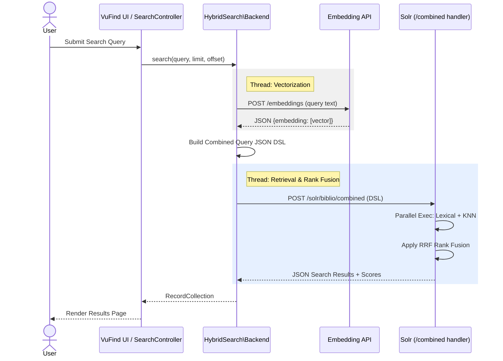

# Hybrid Semantic and Keyword Search Technical Architecture Proposal

## 1. Executive Summary
This document outlines the technical architecture for the integration of Hybrid Search into VuFind using Apache Solr 9.11+. The architecture leverages Reciprocal Rank Fusion (RRF) to combine traditional lexical (keyword) search with semantic (vector) similarity, providing a unified and more relevant retrieval experience.

## 2. High-Level Architecture
The system follows a modular architecture that separates the core VuFind search framework from the specific hybrid logic.

### Components:
- **VuFind Search Service**: Orchestrates the search process across different data sources.
- **HybridSearch Backend**: A specialized backend that extends the existing Semantic Search logic to handle multi-modal query generation.
- **Embedding API**: An external service (managed by the `httpClient`) that converts user queries into high-dimensional vectors.
- **Apache Solr 9.11+**: The indexing and search engine, utilizing the `CombinedQuerySearchHandler` for native RRF execution.

## 3. Detailed Component Analysis

### 3.1 HybridSearch Backend (`HybridSearch\Backend`)
The backend is responsible for:
1.  **Query Decomposition**: Taking the user's search string and preparing it for two distinct paths: Lexical and Semantic.
2.  **Embedding Retrieval**: Calling the Embedding API to obtain the vector representation of the query.
3.  **DSL Construction**: Generating a JSON-based Combined Query DSL that Solr understands.
4.  **Result Merging (RRF)**: Instructing Solr to merge the two ranked lists using the RRF algorithm.

### 3.2 Solr Request Handler (`/combined`)
A custom configuration in `solrconfig.xml` enables the `/combined` endpoint. It uses the `CombinedQuerySearchHandler` class, which is designed to execute multiple sub-queries and fuse their results before returning them to the client.

### 3.3 Solr Connector (`Connector.php`)
The Solr connector was enhanced with a `postJson()` method to support the JSON-body search requests required by the Combined Query handler, moving away from traditional URL-parameter-heavy GET requests.

## 4. Data Flow & Sequence
1.  **User Input**: User submits a query via the Hybrid Search UI.
2.  **Vectorization**: The backend calls the Embedding API (Wait time logged: `Embedding retrieval time`).
3.  **DSL Generation**: The backend builds a JSON payload:
    - `queries`: Contains the `lucene` (lexical) and `knn` (vector) sub-queries.
    - `params`: Specifies `rrf` as the combiner and sets the `k` parameter.
4.  **Solr Execution**: Solr executes both queries in parallel and applies RRF.
5.  **Response**: Solr returns a single ranked list with calculated scores (Wait time logged: `Solr combined search time`).
6.  **UI Rendering**: VuFind displays the results using the `HybridSearch` record driver and templates.

### 4.1 Sequence Diagram

## 5. Reciprocal Rank Fusion (RRF) Implementation
The implementation uses the formula:
`score = 1 / (k + rank_lexical) + 1 / (k + rank_vector)`

- **`rank_lexical`**: Rank of the document in the keyword search results.
- **`rank_vector`**: Rank of the document in the semantic search results.
- **`k`**: A smoothing constant (configurable via `rrfK`, default 60) that prevents high-ranking items from overly dominating the final score.

## 6. Performance & Logging
To ensure transparency and facilitate debugging, the architecture includes:
- **Timing Measurement**: Real-time logging of API calls (Embedding API and Solr).
- **Debug Logs**: Detailed internal state logging in `Backend.php`.
- **Fault Tolerance**: Fallback to standard lexical search if the Embedding API fails or return no results.

## 7. Known Limitations & Future Work
- **Highlighting**: Currently disabled in hybrid mode due to distributed metadata limitations in Solr 9.11's early RRF implementation.
- **Scalability**: Further optimization of the `topKVector` parameter may be needed as the index grows.
- **Advanced Combiners**: Potential future support for other fusion algorithms beyond RRF.
