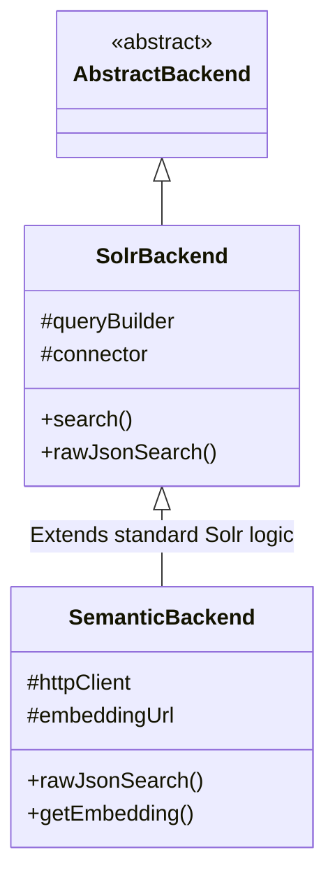

# Analysis: Lexical vs. Semantic Search in VuFind (Solr)

This document analyzes the implementation of standard lexical (keyword-based) search and the new semantic (vector-based) search in VuFind, based on the provided backend code and documentation.

## 1. High-Level Architecture

The implementation follows VuFind's modular backend architecture. Both search types ultimately communicate with Solr, but they process queries differently.

- **Lexical Search**: Uses the standard `VuFindSearch\Backend\Solr\Backend`.
- **Semantic Search**: Uses a custom `VuFindSearch\Backend\SemanticSearch\Backend`, which **extends** the standard Solr backend.

### Component Relationship

---

## 2. Implementation Comparison

| Feature | Lexical Search (Standard Solr) | Semantic Search (Vector-based) |
| :--- | :--- | :--- |
| **Logic Location** | `Solr/Backend.php` | `SemanticSearch/Backend.php` |
| **Query Type** | Keyword matching (lexical) | Vector similarity (embeddings) |
| **Solr Parser** | Typically `edismax` (via `QueryBuilder`) | `{!vectorSimilarity}` or `{!knn}` |
| **Query Processing** | `QueryBuilder` translates VuFind query to Solr string. | 1. Hits External API to get vector.   2. Wraps vector in Solr local params. |
| **Scoring** | TF-IDF / BM25 (Text relevance) | Vector Distance/Similarity (Semantic relevance) |
| **Hybrid Support** | N/A (Standard) | Inherits standard Solr traits but overrides `q`. |

---

## 3. Deep Dive: Solr Backend (Lexical)

The standard backend is a "pass-through" to Solr's powerful text searching capabilities.

- **`search()`**: The entry point. It delegates to `rawJsonSearch()`.
- **`rawJsonSearch()`**: 
  - Uses the `QueryBuilder` to generate parameters like `q`, `qf` (query fields), `bq` (boost queries), etc.
  - Sends these parameters to the `Connector`, which performs the HTTP request to Solr.
- **`Terms`, `Similar`, `Random`**: These features are built into the standard backend, leveraging Solr's `terms` component, `MoreLikeThis` handler, and random sort fields.

---

## 4. Deep Dive: Semantic Search Backend

The semantic backend acts as a **middleware** that enriches the search process with AI-generated vectors.

### Query Lifecycle
1. **Request**: The user submits a search string (e.g., "climate change impacts").
2. **Embedding Generation**: 
   - `getEmbedding($text)` is called.
   - It makes a POST request to an **external Embeddings API** (e.g., a Python service using a Transformer model).
   - The API returns a float array (e.g., 768 dimensions).
3. **Solr Query Construction**:
   - The backend creates a Solr query string: `{!vectorSimilarity f=vector minReturn=...}[0.12, -0.05, ...]`.
4. **Parameter Cleanup**:
   - To ensure Solr treats this as a pure vector search, it removes standard parameters like `qf`, `qt`, and `mm` which are meant for text-based `edismax`.
   - It ensures `score` is requested in the `fl` (field list) so the UI can display the similarity score.
5. **Execution**: The `Connector` sends the vector-wrapped query to Solr's search handler.

---

## 5. Key Documentation Insights (`vufind_semantic_search_full_guide.md`)

- **Schema Requirements**: Solr must be configured with a `DenseVectorField` (e.g., `knn_vector` type) with a matching dimension (768).
- **Configuration**: The `semanticsearch.ini` and `config.ini` files store the API URL and threshold settings (`min_score`, `topK`).
- **UI Integration**: Semantic search has its own controller (`SemanticSearchController`) and templates, allowing the results page to look different (e.g., showing similarity percentages).
- **Optimization**: The guide suggests using `dot_product` similarity and Project Panama (Java 21) for better vector performance.

## 6. Synthesis of Interrelationships

1. **Functional Overlay**: The Semantic backend doesn't replace the Solr backend; it **specializes** it. By extending `SolrBackend`, it keeps all the utility methods (like `deserialize`, `injectResponseWriter`) while only changing the core search execution.
2. **Parallel Systems**: In a hybrid environment, VuFind can run both backends. A user might search the "standard" index (Lexical) or the "semantic" index (Vector) via different tabs or search box options.
3. **Common Infrastructure**: Both share the same `Connector` instance, meaning they talk to the same Solr core but use different fields and query parsers.
