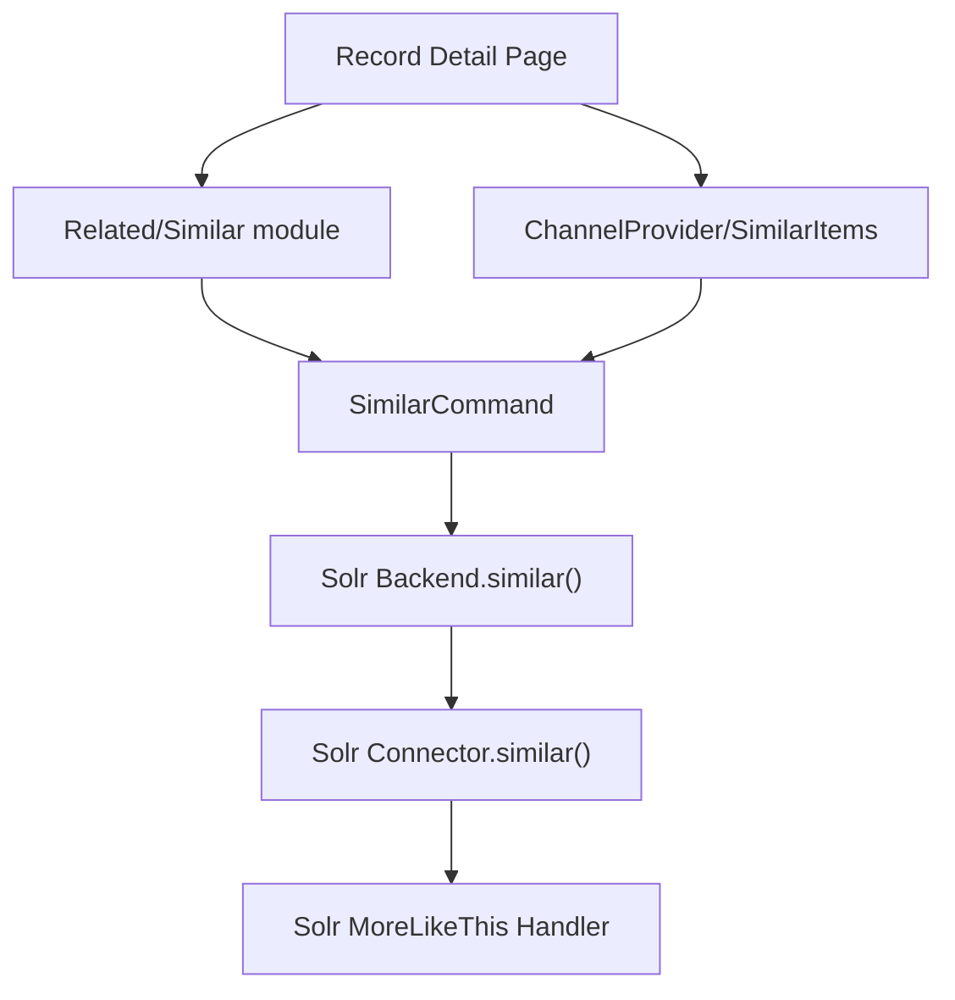

# Similar Items Feature — Code Analysis

## Overview

The **Similar Items** feature in VuFind finds and displays records that are similar to a given record. Under the hood, it uses **Solr's MoreLikeThis (MLT) handler** to compute similarity based on document content (typically fields like title, author, subject).

The feature has **two parallel implementations** that share the same Solr backend:

| Implementation | Purpose | Location |
|---|---|---|
| **Related Records** sidebar | Shows similar items on the record detail page sidebar | `VuFind\Related\Similar` |
| **Channel Provider** | Shows similar items as browsable "channels" (carousels) | `VuFind\ChannelProvider\SimilarItems` |

---

## Architecture



---

## Key Files

### 1. Related Records Module (sidebar)

#### [Similar.php](file:///home/jesielviana/Dev/ioi/vufind/module/VuFind/src/VuFind/Related/Similar.php)

The simpler implementation. Implements `RelatedInterface` and appears as a sidebar panel on the record detail page.

- **`init()`** — Creates a `SimilarCommand` with the record's source and ID, then invokes it via the search service
- **`getResults()`** — Returns the array of similar record drivers

Configured in `config.ini`:
```ini
[Record]
related[] = "Similar"
```

#### [Similar.phtml](file:///home/jesielviana/Dev/ioi/vufind/themes/bootstrap5/templates/Related/Similar.phtml)

Renders the sidebar as a `<ul>` list, delegating each item to `Related/Similar/item.phtml`.

---

### 2. Channel Provider (browsable carousels)

#### [SimilarItems.php](file:///home/jesielviana/Dev/ioi/vufind/module/VuFind/src/VuFind/ChannelProvider/SimilarItems.php)

More complex implementation for the Channels system. Key methods:

| Method | Description |
|---|---|
| `getFromRecord()` | Builds a channel from a single record driver |
| `getFromSearch()` | Builds channels from search results (examines up to `maxRecordsToExamine` records) |
| `buildChannelFromRecord()` | Core method — creates the `SimilarCommand`, queries Solr, and builds channel data with links |

Options:
- **`maxRecordsToExamine`** — How many search results to examine for similar items (default: `2`)
- **`batchSize`** — How many similar records to return per channel

#### [SimilarItemsFactory.php](file:///home/jesielviana/Dev/ioi/vufind/module/VuFind/src/VuFind/ChannelProvider/SimilarItemsFactory.php)

Injects `VuFindSearch\Service`, URL helper, and `Record\Router`.

---

### 3. Search Command Layer

#### [SimilarCommand.php](file:///home/jesielviana/Dev/ioi/vufind/module/VuFindSearch/src/VuFindSearch/Command/SimilarCommand.php)

Extends `CallMethodCommand`. Targets backends that implement `SimilarInterface` and calls their `similar()` method with the record ID and optional parameters.

#### [SimilarInterface.php](file:///home/jesielviana/Dev/ioi/vufind/module/VuFindSearch/src/VuFindSearch/Feature/SimilarInterface.php)

Defines the contract: `similar($id, ?ParamBag $params)` → `RecordCollectionInterface`.

---

### 4. Solr Backend

#### [Backend.similar()](file:///home/jesielviana/Dev/ioi/vufind/module/VuFindSearch/src/VuFindSearch/Backend/Solr/Backend.php#L314-L332)

Builds MLT parameters via `getSimilarBuilder()`, delegates to the connector, and wraps the response in a record collection.

#### [Connector.similar()](file:///home/jesielviana/Dev/ioi/vufind/module/VuFindSearch/src/VuFindSearch/Backend/Solr/Connector.php#L210-L237)

Sends the actual HTTP request to **Solr's MoreLikeThis handler**. Gracefully handles the case where the source document can't be found (returns `{}`).

---

## Configuration

### `config.ini` — [Record] section

```ini
; Enable the Similar sidebar on record pages
related[] = "Similar"

; How many items in the similar carousel tab (default 40)
;similar_carousel_items = 40
```

### `channels.ini` — Channel Provider

```ini
[source.Solr]
record[] = "similaritems"        ; Record-based channels
recordTab[] = "similaritems"     ; Record tab channels
search[] = "similaritems"        ; Search-based channels

[provider.similaritems]
maxRecordsToExamine = 2          ; Records from search results to check
itemsPerRow = 6
rowsPerPage = 1
maxBatchSize = 48

[RecordTab]
label = "Similar Items"          ; Tab label text
```

---

## Data Flow Summary

1. User views a record → VuFind loads the `Similar` related module and/or `SimilarItems` channel provider
2. A `SimilarCommand` is created with the record's backend source and unique ID
3. The command is dispatched to the search service, which routes it to the Solr backend
4. `Backend::similar()` builds MLT parameters and calls `Connector::similar()`
5. The connector sends an HTTP request to Solr's **MoreLikeThis handler**
6. Solr returns records that share similar content (based on term frequency analysis)
7. Results are wrapped in record driver objects and displayed in the UI
