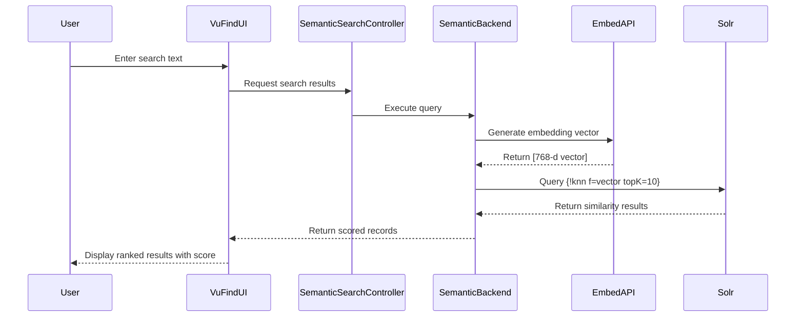

# VuFind Semantic Search Integration with Solr Dense Vectors

This guide explains how to integrate a new **Semantic Search Data Source** into VuFind using **Solr DenseVectorField**.  
It is based on the changes made in the **LA Referencia** repository to enable searches by *meaning* (embeddings) instead of simple keyword matching.

---

## Overview

A new **data source** and **backend logic** have been added to support semantic search.  
This allows searching based on **vector embeddings** rather than just keyword matches.  
The implementation uses Solr’s `DenseVectorField` to store 768-dimensional vectors (typically generated by models such as `paraphrase-multilingual-mpnet-base-v2`).

---

## 1. Solr Schema Preparation (`schema.xml`)

For Solr to handle dense vectors, we must define:

### 🔹 New Field Type: `knn_vector`

A field type for *k-Nearest Neighbors* (k-NN) vector search.

```xml
<fieldType name="knn_vector" class="solr.DenseVectorField"
           vectorDimension="768"
           similarityFunction="dot_product"/>
```

- **`vectorDimension="768"`** — Must match the embedding model dimension.  
- **`similarityFunction="dot_product"`** — Defines how similarity between vectors is computed.

### 🔹 New Field: `vector`

This field stores the document embeddings:

```xml
<field name="vector" type="knn_vector" indexed="true" stored="false"/>
```

- **`indexed="true"`** — Enables search operations.
- **`stored="false"`** — Reduces storage overhead when retrieving results.

> 💡 The vector data is not returned in search results, only used for scoring.

---

## 2. Creating the Semantic Search Backend

The backend acts as the bridge between VuFind and Solr.  
In this implementation, a **custom backend** was created extending the standard Solr backend, adding logic for vector-based queries.

**File:**  
`module/VuFindSearch/src/VuFindSearch/Backend/SemanticSearch/Backend.php`

### 🧠 Key Logic

1. Intercepts the user’s text query.  
2. Sends it to an **external Embeddings API** to generate a vector.  
3. Builds a Solr query using `{!knn}` syntax, for example:  
   ```text
   {!knn f=vector topK=10}[0.1, 0.5, ...]
   ```
4. Optionally applies a filter query (`fq`) using `minScore` to keep only relevant results.

---

## 3. Implementing VuFind Components

To register this new data source as an independent module, the following components were created:

| **Component** | **File / Class** | **Purpose** |
|----------------|------------------|--------------|
| **Controller** | `SemanticSearchController.php` | Handles routes such as `/SemanticSearch/Results`. |
| **RecordDriver** | `RecordDriver/SemanticSearch.php` | Extends `SolrDefault`, adds `getScore()` to display similarity. |
| **Backend Factory** | `Search/Factory/SemanticSearchBackendFactory.php` | Reads `[SemanticSearch]` settings from `config.ini` (API URL, topK, minScore). |
| **Options / Params** | `Search/SemanticSearch/...` | Defines allowed facets and parameters. |
| **Results** | `Search/SemanticSearch/Results.php` | Links the backend results to the correct data source. |

---

## 4. Registering Components in VuFind

To make VuFind recognize these new classes, they must be registered in configuration files.

### `module.config.php`

Registers:
- `SemanticSearchController`
- Routes for `semanticsearch`, `semanticsearchrecord`
- Static routes for `SemanticSearch/FacetList` and `SemanticSearch/Results`
- Record route for `SemanticSearchRecord`


### 🔹 Plugin Managers

Registers aliases for:
- **BackendRegistry** → `SemanticSearch`
- **Options**, **Params**, **Results**, and **RecordDriver** managers

This allows VuFind to dynamically instantiate the correct backend and frontend classes.

---

## 5. User Interface (Templates)

New templates were added under the **Bootstrap 5 theme** to render semantic results:

| **File** | **Description** |
|-----------|-----------------|
| `themes/bootstrap5/templates/RecordDriver/SemanticSearch/result-list.phtml` | Based on standard template; adds “Similarity Score” display. |
| `themes/bootstrap5/templates/semanticsearch/results.phtml` | Wrapper for search results page. |
| `themes/bootstrap5/templates/semanticsearch/facet-list.phtml` | Delegates to standard facet list. |

---

## 6. Configuration files

- `semanticsearch.ini` fill the following with valid values:

```ini
[SemanticSearch]
embedding_api_url = "http://localhost:8000/v1/embeddings"
vector_field      = "vector"
topK              = 1000
default_core      = "biblio"
min_score         = 0.0
model             = "embaas/sentence-transformers-multilingual-e5-large"
encoding_format   = "float"
user              = "user_example"
```

- `searchbox.ini` add:

```ini
type[] = VuFind
target[] = SemanticSearch
label[] = Semantic
group[] = false
```

- `config.ini` add:

```ini
[SemanticSearch]
apiUrl = "http://localhost:8000/embed"
vectorField = "vector"
topK = 10
minScore = 0.8
```

- `config.ini` change value of `defaultModule` to *SemanticSearch*:

```ini
defaultModule   = SemanticSearch
```

If you want to use combined search, change value of `defaultModule` to *Combined* and add the following to `combined.ini`:

- `combined.ini`:

```ini
[SemanticSearch]
label = "Semantic Search"
sublabel = "Vector-based similarity results"
more_link = "More semantic results"
limit = 10
ajax = true
```

* Remove from `combined.ini` the section of data sources configs that are unused, like `[Summon]` and `[EDS]`.


- `config.ini` add `related[] = "SemanticSimilar"` in `[Record]` section to enable the semantic similar items in the record detail page:

```ini
related[] = "Similar"
related[] = "SemanticSimilar"
```


---


## 7. Backend Logic and File Overview

### Files Added

- **`VuFindSearch/Backend/SemanticSearch/Backend.php`**  
  Core logic: vector search, embedding API, and k-NN query generation.

- **`VuFind/Controller/SemanticSearchController.php`**  
  Handles semantic search routes and connects them to VuFind’s search framework.

- **`VuFind/RecordDriver/SemanticSearch.php`**  
  Extends `SolrDefault`, adds support for retrieving and displaying similarity scores.

- **`VuFind/RecordDriver/SemanticSearchFactory.php`**  
  Factory that instantiates the record driver with its configuration.

- **`VuFind/Search/Factory/SemanticSearchBackendFactory.php`**  
  Reads `[SemanticSearch]` settings and initializes the backend with API URL, vector field, topK, minScore.

- **`VuFind/Search/SemanticSearch/Options.php`**,  
  **`Params.php`**, **`Results.php`**  
  Define configuration, parameters, and result container for the semantic backend.

- **Templates:**  
  - `themes/bootstrap5/templates/RecordDriver/SemanticSearch/result-list.phtml`  
  - `themes/bootstrap5/templates/semanticsearch/facet-list.phtml`  
  - `themes/bootstrap5/templates/semanticsearch/results.phtml`

---

### Files Changed

- **`module.config.php`** — Registered controller, routes, backend, and driver factories.  
- **`RecordDriver/PluginManager.php`** — Added alias for SemanticSearch driver and factory.  
- **`Search/BackendRegistry.php`** — Registered new backend alias and factory.  
- **`Search/Options/PluginManager.php`**, **`Params/PluginManager.php`**, **`Results/PluginManager.php`** — Registered standard aliases.  
- **`solr/vufind/biblio/conf/schema.xml`** — Added `knn_vector` type and `vector` field.

---

## 8. Execution Flow (High-Level)



---

## Conclusion

The new **SemanticSearch** data source extends VuFind with full **vector-based semantic retrieval** capabilities.  
It integrates seamlessly into VuFind’s modular backend architecture, enabling hybrid or semantic search interfaces with Solr’s `DenseVectorField`.

This implementation strictly follows VuFind’s **“Connecting a New External Data Source”** documentation while adding modern AI-based search functionality.

## References
- https://vufind.org/wiki/development:howtos:connecting_a_new_external_data_source
- https://solr.apache.org/guide/solr/latest/query-guide/dense-vector-search.html
- [Performance Tuning Apache Solr for Dense Vectors](https://www.youtube.com/watch?v=cDiCX3mVAlQ)
  - Reduce CPU ops
    - Pre-normalize + use dot product similarity ✔️
    - Use aggressive merge policy 
    - Use Java 21 with Project Panama vector module ✔️
      - ` ./solr.sh start  -a "--add-modules jdk.incubator.vector"`
  - Reduce index size
    - Use non-stored vector fields ✔️