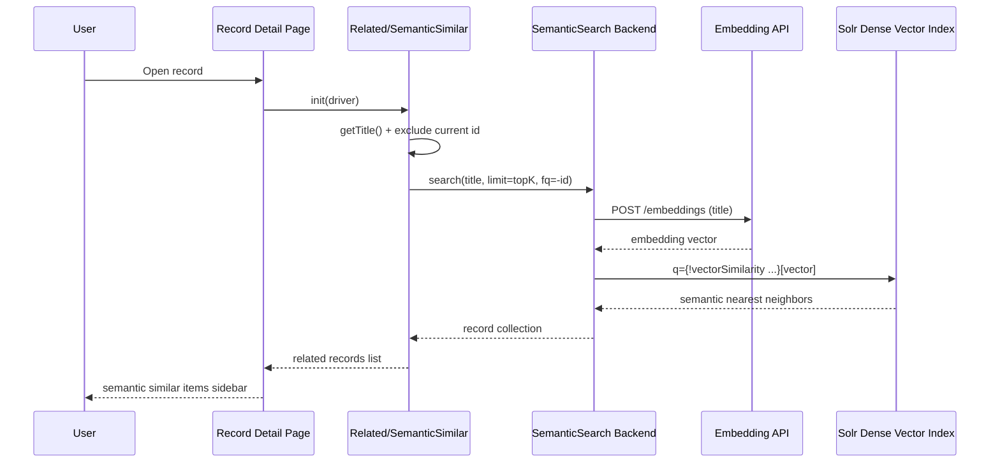

# VuFind Semantic Similar Items Integration Guide

This guide explains how to enable and understand **Semantic Similar Items** in VuFind.

It follows the same style as `vufind_semantic_search_full_guide.md`, but focuses on the **record detail related-items module** that uses dense vectors through the existing `SemanticSearch` backend.

---

## Overview

The **Semantic Similar Items** feature adds a new related-records block to record pages.

Instead of Solr MoreLikeThis term matching, it:

1. Reads the current record title
2. Sends that text through the semantic backend flow (embedding API + vector query)
3. Retrieves nearest neighbors from Solr dense vectors
4. Displays the results in the record sidebar

This is implemented as a VuFind related module:

- Class: `VuFind\Related\SemanticSimilar`
- Factory: `VuFind\Related\SemanticSimilarFactory`
- Template: `themes/bootstrap5/templates/Related/SemanticSimilar.phtml`

---

## 1. Prerequisites

Semantic Similar Items depends on the same semantic stack as Semantic Search.

### 1.1 Solr schema with dense vectors

In the active Solr schema (for example, `solr/vufind/biblio/conf/schema.xml`), define:

```xml
<fieldType name="knn_vector" class="solr.DenseVectorField"
           vectorDimension="768"
           similarityFunction="dot_product"/>

<field name="vector" type="knn_vector" indexed="true" stored="false"/>
```

Notes:

- `vectorDimension` must match your embedding model output dimension.
- `similarityFunction="dot_product"` assumes normalized vectors and efficient scoring.
- `stored="false"` avoids returning raw vectors in responses.

### 1.2 Embedding API available

The backend calls an embedding endpoint configured in `semanticsearch.ini` (`embedding_api_url`).

Expected response shape (OpenAI-compatible embeddings style):

```json
{
  "data": [
    {
      "embedding": [0.01, -0.12, 0.33]
    }
  ]
}
```

---

## 2. Semantic Similar Items Components

### 2.1 Related module class

**File:** `module/VuFind/src/VuFind/Related/SemanticSimilar.php`

Key behavior:

- Implements `RelatedInterface`.
- `init()` stores the record driver for the current page.
- `getResults()`:
  - Gets current record title (`$driver->getTitle()`)
  - Builds a text query from title
  - Adds filter `-id:"<current-id>"` to exclude the source record
  - Calls semantic backend `search(..., 0, $topK, $params)`
  - Returns record drivers for rendering

If title is empty or an exception occurs, returns an empty array safely.

### 2.2 Factory and dependency wiring

**File:** `module/VuFind/src/VuFind/Related/SemanticSimilarFactory.php`

Factory responsibilities:

- Retrieves backend `SemanticSearch` from `BackendManager`
- Reads `semanticsearch` config object
- Uses:
  - `vector_field` (default `vector`)
  - `topK` (default `5` for related-items display)
- Constructs `SemanticSimilar`

### 2.3 Related plugin registration

**File:** `module/VuFind/src/VuFind/Related/PluginManager.php`

Registered alias/factory:

- Alias: `semanticsimilar` → `VuFind\Related\SemanticSimilar`
- Factory: `SemanticSimilarFactory`

This enables `related[] = "SemanticSimilar"` in config.

### 2.4 Sidebar template

**File:** `themes/bootstrap5/templates/Related/SemanticSimilar.phtml`

Template behavior:

- Renders title: `Semantic Similar Items`
- Calls `$this->related->getResults()`
- Displays results using `Related/Similar/item.phtml`
- Shows fallback message when no results are available

---

## 3. Backend Dependency (SemanticSearch)

Semantic Similar Items does not query Solr directly. It delegates to:

- `VuFindSearch\Backend\SemanticSearch\Backend`

**Relevant file:** `module/VuFindSearch/src/VuFindSearch/Backend/SemanticSearch/Backend.php`

High-level backend flow:

1. Accept text query (record title in this case)
2. Call embedding API (`getEmbedding()`)
3. Build Solr vector query using:
   ```text
   {!vectorSimilarity f=<vector_field> minReturn=<min_score>}[...vector...]
   ```
4. Set `q` to semantic query and include `score` in `fl`
5. Return ranked semantic neighbors

---

## 4. Configuration

### 4.1 `semanticsearch.ini`

Create/edit:

- `local/config/vufind/semanticsearch.ini`

Example:

```ini
[SemanticSearch]
embedding_api_url = "http://localhost:8000/v1/embeddings"
vector_field      = "vector"
topK              = 10
default_core      = "biblio"
min_score         = 0.0
model             = "embaas/sentence-transformers-multilingual-e5-large"
encoding_format   = "float"
user              = "user_example"
```

Important keys for Semantic Similar Items:

- `embedding_api_url`: endpoint used to embed record title.
- `vector_field`: dense vector field used by the SemanticSearch backend query builder.
- `topK`: max semantic neighbors requested by related module.
- `min_score`: minimum semantic score returned by backend query.

### 4.2 `config.ini` ([Record] section)

Edit:

- `local/config/vufind/config.ini`

Enable the module:

```ini
[Record]
related[] = "Similar"
related[] = "SemanticSimilar"
```

`Similar` (MLT) and `SemanticSimilar` (vector) can run together.

---

## 5. Execution Flow



---

## 6. File Overview

### Files used directly by Semantic Similar Items

- `module/VuFind/src/VuFind/Related/SemanticSimilar.php`
- `module/VuFind/src/VuFind/Related/SemanticSimilarFactory.php`
- `module/VuFind/src/VuFind/Related/PluginManager.php`
- `themes/bootstrap5/templates/Related/SemanticSimilar.phtml`

### Backend/config files required by dependency chain

- `module/VuFindSearch/src/VuFindSearch/Backend/SemanticSearch/Backend.php`
- `module/VuFind/src/VuFind/Search/Factory/SemanticSearchBackendFactory.php`
- `local/config/vufind/semanticsearch.ini`
- `local/config/vufind/config.ini`

---

## 7. Validation Checklist

After enabling configuration, validate in this order:

1. Solr core is running with updated schema and indexed vectors.
2. Embedding API is reachable from VuFind host.
3. Record page contains `Semantic Similar Items` block.
4. Current record does not appear in its own related results.
5. Results change when record title changes (semantic behavior check).

---

## 8. Troubleshooting

### No semantic similar results

- Check that `vector` field exists and has values in indexed documents.
- Confirm `embedding_api_url` returns valid vectors.
- Lower `min_score` in `semanticsearch.ini`.
- Verify the record has a non-empty title.

### Errors in related module rendering

- Confirm `related[] = "SemanticSimilar"` is under `[Record]`.
- Clear VuFind caches after config changes.
- Check PHP/VuFind logs for `Semantic Similar records module` exceptions.

### Backend returns only keyword-like behavior

- Ensure semantic backend is active (`SemanticSearch` backend wiring intact).
- Verify query is transformed into `vectorSimilarity` syntax in backend path.

---

## Conclusion

`SemanticSimilar` extends VuFind related records with vector-based nearest-neighbor retrieval while reusing the `SemanticSearch` backend infrastructure.

This gives record pages a semantic recommendation block with minimal configuration: enable vectors, configure `semanticsearch.ini`, and register `SemanticSimilar` under `[Record]`.

---

## References

- VuFind related records modules documentation: https://vufind.org/wiki/development:plugins:related_records_modules
- Solr dense vector search: https://solr.apache.org/guide/solr/latest/query-guide/dense-vector-search.html
- Existing semantic search guide: `docs/vufind_semantic_search_full_guide.md`
